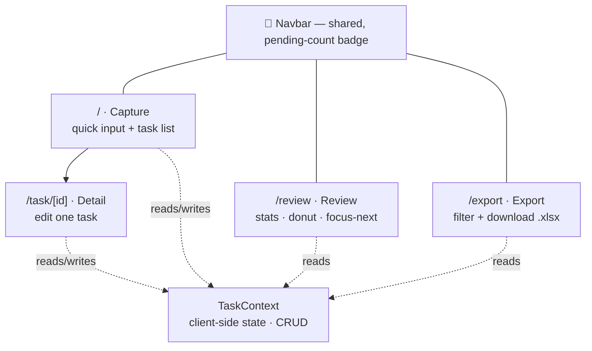

<div align="center">

# ⚡ QuickNote

**Capture ideas fast. Quick in, quick out.**

A lightweight task & idea capture tool — type a thought, hit Enter, move on.
Then review your progress and export it all to Excel.

[](https://nextjs.org/)
[](https://react.dev/)
[](https://www.typescriptlang.org/)
[](https://tailwindcss.com/)

</div>

---

## ✨ Features

- **⌨️ Frictionless capture** — auto-focused input, press <kbd>Enter</kbd> to add. Optional one-tap **priority** (Low / Med / High) and **category** (Work / Study / Life / Ideas).
- **✅ One-click complete** — toggle a task done with a satisfying strikethrough; filter by **All / Pending / Completed**.
- **📊 Review dashboard** — completion rate, category **donut chart**, priority breakdown, "focus next" suggestions, oldest-pending list, and recently-completed items with **time-to-finish** durations.
- **🗂️ Task detail** — open any task on its own page to edit content, priority, and category.
- **📁 Excel export** — filter by status and download a clean `.xlsx` with one click.
- **🔔 Live pending badge** — the navbar always shows how many tasks are still open.
- **🎨 Zen design** — minimal, distraction-free UI with a sticky blurred navbar and subtle fade-in animations.

---

## 🗺️ App map



| Route | Page | What it does |
|-------|------|--------------|
| `/` | **Capture** | Quick-add form + task list with toggle & strikethrough |
| `/review` | **Review** | Stats dashboard: completion rate, category/priority breakdown, insights |
| `/task/[id]` | **Detail** | View & edit a single task (dynamic route) |
| `/export` | **Export** | Preview + one-click Excel download, with status filters |

---

## 🚀 Getting started

```bash
# 1. Install dependencies
npm install

# 2. Run the dev server
npm run dev
```

Open **http://localhost:3000** and start typing.

```bash
npm run build   # production build
npm run start   # serve the production build
npm run lint    # run ESLint
```

> **Requirements:** a recent Node.js LTS (Node 20+, as required by Next.js 16). No environment variables or database setup needed.

---

## 🧱 Tech stack

| Layer | Choice |
|-------|--------|
| Framework | **Next.js 16** (App Router) |
| UI | **React 19** + **Tailwind CSS v4** |
| Language | **TypeScript** |
| State | **React Context** (client-side, in-memory) |
| IDs | `nanoid` |
| Export | `xlsx` (dynamically imported, client-side) |

---

## 📂 Project structure

```
src/
├── app/
│   ├── layout.tsx          # Root layout — wraps app in TaskProvider + Navbar
│   ├── page.tsx            # "/"        Capture page
│   ├── review/page.tsx     # "/review"  Stats dashboard
│   ├── task/[id]/page.tsx  # "/task/:id" Task detail (dynamic route)
│   ├── export/page.tsx     # "/export"  Excel export
│   └── globals.css         # Tailwind + CSS-variable theme
├── components/
│   ├── Navbar.tsx          # Sticky nav with pending-count badge
│   ├── TaskInput.tsx       # Quick capture form (Enter to add, +Options)
│   └── TaskList.tsx        # Task list with checkbox toggle + strikethrough
└── context/
    └── TaskContext.tsx     # Global state provider (add/toggle/update/delete)
```

---

## 🧩 Data model

```typescript
interface Task {
  id: string;              // Unique identifier
  content: string;         // Task text
  completed: boolean;      // Completion status
  createdAt: string;       // ISO timestamp
  completedAt?: string;    // Set when marked done (drives duration insights)
  priority: 'low' | 'medium' | 'high';
  category: string;        // Uncategorized | Work | Study | Life | Ideas
}
```

---

## 📝 Notes & limitations

- **State is in-memory.** Tasks live in React Context, so **refreshing the page clears everything** — navigation between pages keeps state via client-side routing. Persistence (localStorage / a backend) would be the natural next step.
- Excel export runs entirely in the browser; nothing is uploaded anywhere.

---

<div align="center">
<sub>Built with Next.js · Design, Build & Ship — Week 2</sub>
</div>
